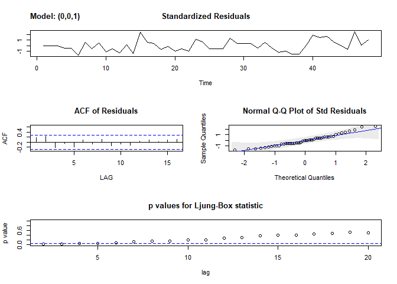

LuteinizingHormone
================
Katie
February 1, 2019

Background
==========

The luteinizing hormone (LH) necessitates fertility in humans. Female ovulation is induced by a rapid surge of LH, which can be measured by analyzing blood samples. Understanding changes in LH levels during ovulation could be useful in assessing a woman's fertility and potentially guiding conception.

Problem
=======

A female patient has provided a series of blood samples from which the LH levels have been measured.The goal of this activity was to analyze changes in LH hormone levels during ovulation through answering the following questions:

-   Is the LH hormone level over time a stationary process?
-   Does a suitable model exist that could be used to predict future hormone levels?
-   If a model exists, what is the equation for the model?

Data Source
===========

The data were obtained from library(datasets) in R, but was was originally released in a Biostatistical reference book (Diggens, 1990). The data set contains 48 samples at 10-minute intervals that were obtained from the female patient.

Exploring Data & Assessing Stationarity
=======================================

The data were visualized in a time series plot, as shown below. The autocorrelations were also plotted in order to assess stationarity. The plots were examined to determine if the behavior was consistent with that of any known classes of time series models, such as the autoregressive or moving average models.

The autocorrelations at various lags were plotted, as shown in the correlogram above. The autocorrelation appeared to decay after the first lag, remaining within the confidence bounds thereafter. The apparent lack of dependence of the ACF on time is consistent with stationarity. Furthermore, the series did not appear to exhibit any strong or persistant trends, aside from a few peaks and valleys, that would have suggested a non-constant mean or variance.

In terms of candidate models, an autocorrelation that decays after the first lag could suggest a first order moving average. However, it is also possible that the series could be autoregressive, if the slight oscillations contained within the confidence bounds of the correlogram are not regarded as insignificant. It is conceivable that these autocorrelations are simply *close*, but not necessarily equal, to zero. If that is the case, then the ACF could be interpreted as "tailing off" rather than "dying out", which would be more consistent with the expected behavior for an autoregressive series.

To test these theories, the partial acf should also be generated, plotted, and examined. The pacf behavior should then be compared to the general expectations for both AR and MA models.

As illustrated in the above plot, the partial autocorrelations appear to "die out" after lag=1 and remain within the confidence bounds thereafter. This behavior is more consistent with that of an AR(1). However, as was the case with the acf, it is also conceivable that the series could be a moving average, if we regard the lags within the confidence bounds as non-zero.

Analyzing & Selecting Models
============================

In addition to full and partial autocorrelations, information criteria was also used to select the optimal model. Aikake Information Criterion (AIC) and Bayesian Information Criterion (BIC) assign scores to models based on both goodness-of-fit and model complexity, with the key difference being that BIC penalizes complexity more than AIC. The auto.arima() function applies AIC and BIC over all possible models and selects the model with the best (lowest) score.The function also considers the corrected Aikake Information Criterion (*A**I**C**c*), which also akes the sample size into account. This is important because larger samples more accurately reflect the population than smaller samples. The result of the function is shown below.

    ## Series: lh 
    ## ARIMA(1,0,0) with non-zero mean 
    ## 
    ## Coefficients:
    ##          ar1    mean
    ##       0.5739  2.4133
    ## s.e.  0.1161  0.1466
    ## 
    ## sigma^2 estimated as 0.2061:  log likelihood=-29.38
    ## AIC=64.76   AICc=65.3   BIC=70.37

As shown above, auto.arima() recommended an AR(1) model of the form *x**t* = 0.5739*x**t* − 1 + 2.4133. This model was a reasonable candidate, since an AR(1) was one of the initial classes considered based on the ACF and PACF. Despite the results of auto.arima(), the other class initially considered, an MA(1), was retained as a second candidate. Aside from less favorable information criteria, there was not yet a reason to discard this candidate. The next step was to estimate paramters for the optimal MA(1) model and test whether any assumptions made had been violated in either of the two candidate models. Violations would serve as the basis for discarding a model candidate.

Evaluating Model Assumptions
============================

The assumptions made when fitting the time series models pertain to the model's residuals. A model's residuals are the error terms, or differences between the modeled value and actual value of each observation. Residuals that are overall closer to zero could thus indicate a better fit. Residuals that are correlated or follow a clear pattern could indicate the existance of another predictor variable that should have been considered, which would compromise the integrity of the model. Residual analysis is used to identify violations of the following conditions: \* The residuals are stationary and uncorrelated \* The standardized residuals are an iid sequence with mean zero and a variance of one \* The residuals are normally distributed with few outliers \* The residuals are independent

The sarima( ) function was used to estimate parameters for the optimal model for the MA(1), the second candidate. For both model candidates, the resulting MA(1) and the AR(1), the sarima() function was also used for residual analysis to test the conditions delineated above. This function outputs a time series plot, a correlogram, and a Normal Q-Q plot for the standardized residuals to evaluate residual stationarity, check for patterns, and assess normality. The sarima( ) output also includes a plot for the p-values of the Ljung Box test, which tests the null hypothesis of residual independence at each lag. In addition to residual analysis, sarima( ) also outputs information criteria to allow for further comparison between candidates. Finally, for each parameter estimate, sarima( ) supplies the associated p-value, which can be used to reject the significance of the associated term.

    ## initial  value -0.594944 
    ## iter   2 value -0.800449
    ## iter   3 value -0.800581
    ## iter   4 value -0.800619
    ## iter   5 value -0.800623
    ## iter   6 value -0.800623
    ## iter   6 value -0.800623
    ## final  value -0.800623 
    ## converged
    ## initial  value -0.806760 
    ## iter   2 value -0.806860
    ## iter   3 value -0.806873
    ## iter   4 value -0.806873
    ## iter   4 value -0.806873
    ## iter   4 value -0.806873
    ## final  value -0.806873 
    ## converged

    ## initial  value -0.605471 
    ## iter   2 value -0.763988
    ## iter   3 value -0.766338
    ## iter   4 value -0.774439
    ## iter   5 value -0.774775
    ## iter   6 value -0.774789
    ## iter   7 value -0.774789
    ## iter   7 value -0.774789
    ## iter   7 value -0.774789
    ## final  value -0.774789 
    ## converged
    ## initial  value -0.771987 
    ## iter   2 value -0.772013
    ## iter   3 value -0.772023
    ## iter   3 value -0.772023
    ## iter   3 value -0.772023
    ## final  value -0.772023 
    ## converged

For M1, the AR(1) model, residual analysis did not show that any conditions had been violated. As illustrated in the Ljung-Box test plot, the p-values for all Q-statistics exceeded *α* = 0.05. This indicated that that the null hypothesis need not be rejected and that the residual independence assumption had not been violated. Conversely, for the MA(2), the null hypothesis was rejected for the first four Q-statistics on the basis that *p* ≤ *α*. This meant that the independence assumption had been violated and that the model should be discarded.

None of the other conditions appeared to have been violated in either model: the QQ plots *largely* indicated normality, there were few outlying standardized residuals, and the residuals appeared stationary.

Even though M2 should be discarded based on the independence assumption violation, information criteria and mean resiudal value were used to compare the models for additional confirmation. 

As shown in the above table, the mean residual value for both models was close to zero. As expected, information criteria favored M1, the AR(1).

Comparison to Theory & Other Samples
====================================

To further evaluate the model, the theoretical/population ACF for the model was compared to that of the lh hormone. For further confirmation, several random samples of the model were simulated and the ACFs were compared to those of = the lh sample and the population. The purpose of the simulated samples was to gain insight into how samples of the model deviate from the population. Multiple samples were simulated before setting the seed that produced the series plotted below.

Conclusion
==========

Based on patterns observed in the sample ACF, the mangitude of $\\hat{\\phi}$, goodness-of-fit, results of residual analysis, and resemblence to other samples of known classes, the LH sample likely a stationary process for which an AR(1) is a very strong candidate. The equation for the optimal AR(1) model is *x**t* = 0.5739*x**t* − 1 + 2.4133.

In terms of forecasting, a first order autoregressive model allows for observations to be predicted more easily, as the only input required is the previous observation. In the context of this problem, the model could be very useful in predicting LH levels in 10 second intervals immediately following those taken from the female. Using only one of the blood draws, estimates from the entire sample could be reconstructed.

Unforunately, the model's usefulness is limited by the size and time frame of the sample upon which it was built. 48 samples were taken within 480 seconds from one female, about whom little else is known. As elapsed time from the last observation increases, the degree of error for predictions also increases. Thus, the model could not be expected to accurately predict LH levels at times that are not in the immediate future. Additionally, the model could not be reliably applied to any other female patient. Finally, the manner in which other factors may impact LH levels is not known.

References
==========

P.J. Diggle (1990) Time Series: A Biostatistical Introduction. Oxford, table A.1, series 3
